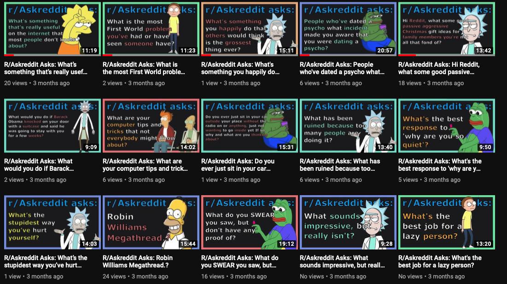

# Generate Content Automatically for YouTube

No longer working since COPPA caused changes to the youtube API. Also, this is some pretty old code of mine, which is mostly here for posterity...

Script's channel: 
https://www.youtube.com/channel/UCznMOuHFQ_c_Oi9n9VhfxfQ/featured

This script produces edited videos from Reddit

It has successfully generated tons of content without assistance 

